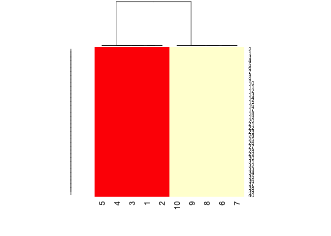

Warmup
------

In this lesson we'll discuss principal component analysis (PCA) and singular value decomposition (SVD), two important and related techniques of dimension reduction. This last entails processes which finding subsets of variables in datasets that contain their essences. PCA and SVD are used in both the exploratory phase and the more formal modelling stage of analysis. We'll focus on the exploratory phase and briefly touch on some of the underlying theory.

We'll begin with a motivating example - random data.

This is dataMatrix, a matrix of 400 random normal numbers (mean 0 and standard deviation 1). We're displaying it with the R command image. Run the R command head with dataMatrix as its argument to see what dataMatrix looks like.

``` r
set.seed(666)
dataMatrix <- matrix(rnorm(400), 40, 10)
head(dataMatrix)
```

    ##            [,1]       [,2]        [,3]       [,4]       [,5]        [,6]
    ## [1,]  0.7533110  0.7256016  1.48961190 -0.7736897 -0.1961569  2.02107799
    ## [2,]  2.0143547 -0.4887339  0.88763819  1.2335281  1.1961211  1.29189400
    ## [3,] -0.3551345 -0.4841213 -0.32840035  0.6379436 -0.4950295 -0.26076088
    ## [4,]  2.0281678  1.8455936 -1.28334614  1.0274259  2.1917549  1.33885219
    ## [5,] -2.2168745  0.5154342 -0.01438467 -0.2218026 -1.2404699  0.57186478
    ## [6,]  0.7583962 -1.1147874  1.00533794  1.1422597  0.6245431 -0.08494076
    ##            [,7]        [,8]       [,9]      [,10]
    ## [1,]  0.6505015  1.50454451 -1.6825021 -0.7551830
    ## [2,] -1.6469144 -0.92365750  0.1689043  0.7187608
    ## [3,] -1.0867267 -0.18579196 -0.3556014  0.9168569
    ## [4,] -0.6082197  0.46892048 -0.8385094 -0.2469335
    ## [5,] -0.2685677 -2.53873016  1.6394906 -0.3708208
    ## [6,]  0.1894976 -0.08550338 -0.2458062 -0.1995604

So we see that dataMatrix has 10 columns (and hence 40 rows) of random numbers. The image here looks pretty random. Let's see how the data clusters. Run the R command heatmap with dataMatrix as its only argument.

``` r
heatmap(dataMatrix)
```

<!-- -->

We can see that even with the clustering that heatmap provides, permuting the rows (observations) and columns (variables) independently, the data still looks random.

Let's add a pattern to the data. We've put some R code in the file addPatt.R for you. Run the command myedit with the single argument "addPatt.R" (make sure to use the quotation marks) to see the code. You might have to click your cursor in the console after you do this to keep from accidentally changing the file.

``` r
set.seed(678910)
for (i in 1:40) {
        coinFlip <- rbinom(1, size = 1, prob = 0.5)
        
        if(coinFlip){
                dataMatrix[i,] <- dataMatrix[i,] + rep(c(0,3), each = 5)
        }
}
```

So in rows affected by the coin flip, the 5 left columns will still have a mean of 0 but the right 5 columns will have a mean closer to 3.

Now to execute this code, run the R command source with 2 arguments. The first is the filename (in quotes), "addPatt.R", and the second is the argument local set equal to TRUE.

``` r
heatmap(dataMatrix,Rowv = NA, Colv = NA)
```

<!-- -->

Here's the image of the altered dataMatrix after the pattern has been added. The pattern is clearly visible in the columns of the matrix. The right half is yellower or hotter, indicating higher values in the matrix.

Now run the R command heatmap again with dataMatrix as its only argument. This will perform a hierarchical cluster analysis on the matrix.

``` r
heatmap(dataMatrix)
```

<!-- -->

Again we see the pattern in the columns of the matrix. As shown in the dendrogram at the top of the display, these split into 2 clusters, the lower numbered columns (1 through 5) and the higher numbered ones (6 through 10). Recall from the code in addPatt.R that for rows selected by the coinflip the last 5 columns had 3 added to them. The rows still look random.

``` r
par(mfrow = c(1,2))
row_clust <- hclust(dist(dataMatrix))
row_means <- apply(dataMatrix, 1, mean)
plot(row_means[row_clust$order], 1:40, xlab = "Row Means")

col_clust <- hclust(dist(t(dataMatrix)))
col_means <- apply(dataMatrix, 2, mean)
plot(1:10, col_means[col_clust$order], xlab = "Column Means")
```

<!-- -->

The left display shows the mean of each of the 40 rows (along the x-axis). The rows are shown in the same order as the rows of the heat matrix on the left. The rightmost display shows the mean of each of the 10 columns. Here the column numbers are along the x-axis and their means along the y.

We see immediately the connection between the yellow (hotter) portion of the cluster image and the higher row means, both in the upper right portion of the displays. Similarly, the higher valued column means are in the right half of that display and lower colummn means are in the left half.

Now we'll talk a little theory. Suppose you have 1000's of multivariate variables X\_1, ... ,X\_n. By multivariate we mean that each X\_i contains many components, i.e., X\_i = (X\_{i1}, ... , X\_{im}. However, these variables (observations) and their components might be correlated to one another.

As data scientists, we'd like to find a smaller set of multivariate variables that are uncorrelated AND explain as much variance (or variability) of the data as possible. This is a statistical approach.

In other words, we'd like to find the best matrix created with fewer variables (that is, a lower rank matrix) that explains the original data. This is related to data compression.

SVD
---

Two related solutions to these problems are PCA which stands for Principal Component Analysis and SVD, Singular Value Decomposition. This latter simply means that we express a matrix X of observations (rows) and variables (columns) as the product of 3 other matrices, i.e., X=UDV^t. This last term (V^t) represents the transpose of the matrix V.

Here U and V each have orthogonal (uncorrelated) columns. U's columns are the left singular vectors of X and V's columns are the right singular vectors of X. D is a diagonal matrix, by which we mean that all of its entries not on the diagonal are 0. The diagonal entries of D are the singular values of X.

To illustrate this idea we created a simple example matrix called mat. Look at it now.

``` r
mat <- matrix(c(1,2,2,5,3,7), nrow = 2, ncol = 3)
mat
```

    ##      [,1] [,2] [,3]
    ## [1,]    1    2    3
    ## [2,]    2    5    7

So mat is a 2 by 3 matrix. Lucky for us R provides a function to perform singular value decomposition. It's called, unsurprisingly, svd. Call it now with a single argument, mat.

``` r
svd(mat)
```

    ## $d
    ## [1] 9.5899624 0.1806108
    ## 
    ## $u
    ##            [,1]       [,2]
    ## [1,] -0.3897782 -0.9209087
    ## [2,] -0.9209087  0.3897782
    ## 
    ## $v
    ##            [,1]       [,2]
    ## [1,] -0.2327012 -0.7826345
    ## [2,] -0.5614308  0.5928424
    ## [3,] -0.7941320 -0.1897921

We see that the function returns 3 components, d which holds 2 diagonal elements, u, a 2 by 2 matrix, and v, a 3 by 2 matrix. We stored the diagonal entries in a diagonal matrix for you, diag, and we also stored u and v in the variables matu and matv respectively. Multiply matu by diag by t(matv) to see what you get. (This last expression represents the transpose of matv in R). Recall that in R matrix multiplication requires you to use the operator %\*%.

``` r
svd_mat <- svd(mat)
matu <- svd_mat$u
matv <- svd_mat$v
diag <- diag(svd_mat$d)
matu %*% diag %*% t(matv)
```

    ##      [,1] [,2] [,3]
    ## [1,]    1    2    3
    ## [2,]    2    5    7

So we did in fact get mat back. That's a relief! Note that this type of decomposition is NOT unique.

### PCA

Now we'll talk a little about PCA, Principal Component Analysis, "a simple, non-parametric method for extracting relevant information from confusing data sets." We're quoting here from a very nice concise paper on this subject which can be found at <http://arxiv.org/pdf/1404.1100.pdf>. The paper by Jonathon Shlens of Google Research is called, A Tutorial on Principal Component Analysis.

Basically, PCA is a method to reduce a high-dimensional data set to its essential elements (not lose information) and explain the variability in the data. We won't go into the mathematical details here, (R has a function to perform PCA), but you should know that SVD and PCA are closely related.

We'll demonstrate this now. First we have to scale mat, our simple example data matrix. This means that we subtract the column mean from every element and divide the result by the column standard deviation. Of course R has a command, scale, that does this for you. Run svd on scale of mat.

``` r
svd(scale(mat))
```

    ## $d
    ## [1] 1.732051 0.000000
    ## 
    ## $u
    ##            [,1]      [,2]
    ## [1,] -0.7071068 0.7071068
    ## [2,]  0.7071068 0.7071068
    ## 
    ## $v
    ##           [,1]       [,2]
    ## [1,] 0.5773503 -0.5773503
    ## [2,] 0.5773503  0.7886751
    ## [3,] 0.5773503 -0.2113249

Now run the R program prcomp on scale(mat). This will give you the principal components of mat. See if they look familiar.

``` r
prcomp(scale(mat))
```

    ## Standard deviations:
    ## [1] 1.732051 0.000000
    ## 
    ## Rotation:
    ##            PC1        PC2
    ## [1,] 0.5773503 -0.5773503
    ## [2,] 0.5773503  0.7886751
    ## [3,] 0.5773503 -0.2113249

Notice that the principal components of the scaled matrix, shown in the Rotation component of the prcomp output, ARE the columns of V, the right singular values. Thus, PCA of a scaled matrix yields the V matrix (right singular vectors) of the same scaled matrix.

Now that we covered the theory let's return to our bigger matrix of random data into which we had added a fixed pattern for some rows selected by coinflips. The pattern effectively shifted the means of the rows and columns.

Here's a picture showing the relationship between PCA and SVD for that bigger matrix. We've plotted 10 points (5 are squished together in the bottom left corner). The x-coordinates are the elements of the first principal component (output from prcomp), and the y-coordinates are the elements of the first column of V, the first right singular vector (gotten from running svd). We see that the points all lie on the 45 degree line represented by the equation y=x. So the first column of V IS the first principal component of our bigger data matrix.

``` r
par(mfrow = c(1,1))
PCA_dataMatrix <- prcomp(scale(dataMatrix))
SVD_dataMatrix <- svd(scale(dataMatrix))
plot(PCA_dataMatrix$rotation[,1], SVD_dataMatrix$v[,1], xlab = "Principle Component", ylab = "SVD")
abline(a=0, b=1, lty=2, col = "pink")
```

<!-- -->

To prove we're not making this up, we've run svd on dataMatrix and stored the result in the object svd1. This has 3 components, d, u and v. look at the first column of V now. It can be viewed by using the svd1$v\[,1\] notation.

``` r
svd1 <- svd(scale(dataMatrix))
svd1$v[,1]
```

    ##  [1] -0.10630535  0.01936410 -0.21444461  0.09008760 -0.03311761
    ##  [6] -0.44480450 -0.42377171 -0.43715264 -0.42966410 -0.42423813

See how these values correspond to those plotted? Five of the entries are slightly to the left of the point (-0.4,-0.4), three more are negative (to the left of (0,0)), and two are positive (to the right of (0,0)).

Here we again show the clustered data matrix on the left. Next to it we've plotted the first column of the U matrix associated with the scaled data matrix. This is the first LEFT singular vector and it's associated with the ROW means of the clustered data. You can see the clear separation between the top 24 (around -0.2) row means and the bottom 16 (around 0.2). We don't show them but note that the other columns of U don't show this pattern so clearly.

``` r
heatmap(dataMatrix)
```

<!-- -->

``` r
par(mfrow=c(1,2))
svd1_u <- svd1$u[,1]
svd1_cluster_row <- hclust(dist(scale(dataMatrix)))
plot(svd1_u[svd1_cluster_row$order], 1:40, xlab = "Row")

svd1_v <- svd1$v[,1]
svd1_cluster_col <- hclust(dist(scale(t(dataMatrix))))
plot(1:10, svd1_v[svd1_cluster_col$order], xlab = "Column")
```

<!-- -->

The rightmost display shows the first column of the V matrix associated with the scaled and clustered data matrix. This is the first RIGHT singular vector and it's associated with the COLUMN means of the clustered data. You can see the clear separation between the left 5 column means (between -0.1 and 0.1) and the right 5 column means (all below -0.4). As with the left singular vectors, the other columns of V don't show this pattern as clearly as this first one does.

So the singular value decomposition automatically picked up these patterns, the differences in the row and column means.

### First column is special

Why were the first columns of both the U and V matrices so special? Well as it happens, the D matrix of the SVD explains this phenomenon. It is an aspect of SVD called variance explained. Recall that D is the diagonal matrix sandwiched in between U and V^t in the SVD representation of the data matrix. The diagonal entries of D are like weights for the U and V columns accounting for the variation in the data. They're given in decreasing order from highest to lowest. Look at these diagonal entries now. Recall that they're stored in svd1$d.

``` r
svd1$d
```

    ##  [1] 12.124989  7.657330  6.582562  6.180608  5.809738  5.271433  4.000222
    ##  [8]  3.482900  2.982208  2.062258

Here's a display of these values (on the left). The first one (12.46) is significantly bigger than the others. Since we don't have any units specified, to the right we've plotted the proportion of the variance each entry represents. We see that the first entry accounts for about 40% of the variance in the data. This explains why the first columns of the U and V matrices respectively showed the distinctive patterns in the row and column means so clearly.

``` r
par(mfrow=c(1,2))
plot(svd1$d, xlab = "Column", ylab = "Singular Value")

diag_prop <- svd1$d / sum(svd1$d)
plot(diag_prop, xlab = "Column", ylab = "Prop. of Variance Explained")
```

<!-- -->

### Show SVD explains variance

Now we'll show you another simple example of how SVD explains variance. We've created a 40 by 10 matrix, constantMatrix. Use the R command head with constantMatrix as its argument to see the top rows.

``` r
constantMatrix <- matrix(rep(c(0,1), each = 200), 40, 10)
head(constantMatrix)
```

    ##      [,1] [,2] [,3] [,4] [,5] [,6] [,7] [,8] [,9] [,10]
    ## [1,]    0    0    0    0    0    1    1    1    1     1
    ## [2,]    0    0    0    0    0    1    1    1    1     1
    ## [3,]    0    0    0    0    0    1    1    1    1     1
    ## [4,]    0    0    0    0    0    1    1    1    1     1
    ## [5,]    0    0    0    0    0    1    1    1    1     1
    ## [6,]    0    0    0    0    0    1    1    1    1     1

The rest of the rows look just like these. You can see that the left 5 columns are all 0's and the right 5 columns are all 1's. We've run svd with constantMatrix as its argument for you and stored the result in svd2. Look at the diagonal component, d, of svd2 now.

``` r
svd2 <- svd(constantMatrix)
svd2$d
```

    ##  [1] 1.414214e+01 1.293147e-15 2.515225e-16 8.585184e-31 9.549693e-32
    ##  [6] 3.330034e-32 2.022600e-46 4.362170e-47 1.531252e-61 0.000000e+00

``` r
heatmap(constantMatrix)
```

<!-- -->

``` r
par(mfrow=c(1,2))
plot(1:10, svd2$d, xlab = "Column", ylab = "Singular Value")
plot(1:10, svd2$d/sum(svd2$d), xlab = "Column", ylab = "Prop. of Variance Explained")
```

<!-- -->

So the first entry by far dominates the others. Here the picture on the left shows the heat map of constantMatrix. You can see how the left columns differ from the right ones. The middle plot shows the values of the singular values of the matrix, i.e., the diagonal elements which are the entries of svd2$d. Nine of these are 0 and the first is a little above 14. The third plot shows the proportion of the total each diagonal element represents.

So what does this mean? Basically that the data is one-dimensional. Only 1 piece of information, namely which column an entry is in, determines its value.

### A more complicated example

Now let's return to our random 40 by 10 dataMatrix and consider a slightly more complicated example in which we add 2 patterns to it. Again we'll choose which rows to tweak using coinflips. Specifically, for each of the 40 rows we'll flip 2 coins. If the first coinflip is heads, we'll add 5 to each entry in the right 5 columns of that row, and if the second coinflip is heads, we'll add 5 to just the even columns of that row.

``` r
set.seed(666)
dataMatrix <- matrix(rnorm(400), 40, 10)

set.seed(678910)
for (i in 1:40){
        # Flip 2 coins
        flip1 <- rbinom(1, 1, 0.5)
        flip2 <- rbinom(1, 1, 0.5)
        
        if(flip1){
                dataMatrix[i,] <- dataMatrix[i,] + rep(c(0,5), each = 5)
        }

        if(flip2){
                dataMatrix[i, seq(2, 10, by = 2)] <- dataMatrix[i, seq(2,10,by=2)] + 5
        }
}
```

So here's the image of the scaled data matrix on the left. We can see both patterns, the clear difference between the left 5 and right 5 columns, but also, slightly less visible, the alternating pattern of the columns. The other plots show the true patterns that were added into the affected rows. The middle plot shows the true difference between the left and right columns, while the rightmost plot shows the true difference between the odd numbered and even-numbered columns.

``` r
par(mfrow=c(1,3))
cluster_row <- hclust(dist(dataMatrix))
cluster_col <- hclust(dist(t(dataMatrix)))
dataMatrix_image <- dataMatrix[rev(cluster_row$order),]
image(t(dataMatrix_image))

col_means <- apply(dataMatrix, 2, mean)
plot(rep(c(0,1), each = 5), xlab = "Column", ylab = "Pattern 1")
plot(rep(c(0,1), times = 5), xlab = "Column", ylab = "Pattern 2")
```

<!-- -->

The question is, "Can our analysis detect these patterns just from the data?" Let's see what SVD shows. Since we're interested in patterns on columns we'll look at the first two right singular vectors (columns of V) to see if they show any evidence of the patterns.

``` r
par(mfrow = c(1,3))
image(t(dataMatrix_image))

svd2 <- svd(scale(dataMatrix))
plot(1:10, svd2$v[,1], xlab = "Column", ylab = "First right singular vector")
plot(1:10, svd2$v[,2], xlab = "Column", ylab = "Second right singular vector")
```

<!-- -->

Here we see the 2 right singular vectors plotted next to the image of the data matrix. The middle plot shows the first column of V and the rightmost plot the second. The middle plot does show that the last 5 columns have higher entries than the first 5. This picks up, or at least alludes to, the first pattern we added in which affected the last 5 columns of the matrix. The rightmost plot, showing the second column of V, looks more random. However, closer inspection shows that the entries alternate or bounce up and down as you move from left to right. This hints at the second pattern we added in which affected only even columns of selected rows.

To see this more closely, look at the first 2 columns of the v component. We stored the SVD output in the svd object svd2.

``` r
svd2$v[,1:2]
```

    ##              [,1]        [,2]
    ##  [1,] -0.03730756 -0.27013485
    ##  [2,]  0.35316589  0.41067901
    ##  [3,]  0.01641439 -0.31950798
    ##  [4,]  0.33896633  0.40351353
    ##  [5,] -0.09485433  0.04287324
    ##  [6,]  0.43543760 -0.00806247
    ##  [7,]  0.30652863 -0.49686351
    ##  [8,]  0.43343633  0.03010621
    ##  [9,]  0.30908511 -0.49286984
    ## [10,]  0.42749350  0.02928944

Seeing the 2 columns side by side, we see that the values in both columns alternately increase and decrease. However, we knew to look for this pattern, so chances are, you might not have noticed this pattern if you hadn't known if was there. This example is meant to show you that it's hard to see patterns, even straightforward ones.

Now look at the entries of the diagonal matrix d resulting from the svd. Recall that we stored this output for you in the svd object svd2.

``` r
svd2$d
```

    ##  [1] 13.996800  7.995747  6.709878  6.066711  5.487768  2.628240  2.130767
    ##  [8]  1.817319  1.433379  1.187237

``` r
par(mfrow = c(1,2))
plot(svd2$d, ylab = "Singular value")
plot((svd2$d)^2/sum((svd2$d)^2), ylab = "Percent of variance explained")
```

<!-- -->

We see that the first element, 14, dominates the others. Here's the plot of these diagonal elements of d. The left shows the numerical entries and the right show the percentage of variance each entry explains.

So the first element which showed the difference between the left and right halves of the matrix accounts for roughly 50% of the variation in the matrix, and the second element which picked up the alternating pattern accounts for 18% of the variance. The remaining elements account for smaller percentages of the variation. This indicates that the first pattern is much stronger than the second. Also the two patterns confound each other so they're harder to separate and see clearly. This is what often happens with real data.

### Dealing with missing data

Now you're probably convinced that SVD and PCA are pretty cool and useful as tools for analysis, but one problem with them that you should be aware of, is that they cannot deal with MISSING data. Neither of them will work if any data in the matrix is missing. (You'll get error messages from R in red if you try.) Missing data is not unusual, so luckily we have ways to work around this problem. One we'll just mention is called imputing the data.

This uses the k nearest neighbors to calculate a values to use in place of the missing data. You may want to specify an integer k which indicates how many neighbors you want to average to create this replacement value. The bioconductor package (<http://bioconductor.org>) has an impute package which you can use to fill in missing data. One specific function in it is impute.knn.

### Power of singular value decomposition

We'll move on now to a final example of the power of singular value decomposition and principal component analysis and how they work as a data compression technique.

Consider this low resolution image file showing a face. We'll use SVD and see how the first several components contain most of the information in the file so that storing a huge matrix might not be necessary.

The image data is stored in the matrix faceData. Run the R command dim on faceData to see how big it is.

``` r
par(mfrow = c(1,1))
faceData <- as.matrix(read.csv("faceData.csv")[, 2:33])
dim(faceData)
```

    ## [1] 32 32

``` r
image(t(faceData[32:1, ]))
```

<!-- -->

So it's not that big of a file but we want to show you how to use what you learned in this lesson. We've done the SVD and stored it in the object svd1 for you. Here's the plot of the variance explained.

``` r
faceData_svd <- svd(scale(faceData))
plot(1:32, (faceData_svd$d)^2/sum((faceData_svd$d)^2), xlab="Singular vector", 
     ylab = "Variance explained")
```

<!-- -->

So 40% of the variation in the data matrix is explained by the first component, 22% by the second, and so forth. It looks like most of the variation is contained in the first 10 components. How can we check this out? Can we try to create an approximate image using only a few components?

Recall that the data matrix X is the product of 3 matrices, that is X=UDV^t. These are precisely what you get when you run svd on the matrix X.

Suppose we create the product of pieces of these, say the first columns of U and V and the first element of D. The first column of U can be interpreted as a 32 by 1 matrix (recall that faceData was a 32 by 32 matrix), so we can multiply it by the first element of D, a 1 by 1 matrix, and get a 32 by 1 matrix result. We can multiply that by the transpose of the first column of V, which is the first principal component. (We have to use the transpose of V's column to make it a 1 by 32 matrix in order to do the matrix multiplication properly.)

Alas, that is how we do it in theory, but in R using only one element of d means it's a constant. So we have to do the matrix multiplication with the %\*% operator and the multiplication by the constant (svd1$d\[1\]) with the regular multiplication operator \*.

Try this now and put the result in the variable a1. Recall that svd1$u, svd1$d, and svd1$v contain all the information you need. NOTE that because of the peculiarities of R's casting, if you do the scalar multiplication with the \* operator first (before the matrix multiplication with the %\*% operator) you MUST enclose the 2 arguments (svd1$u\[,1\] and svd1$d\[1\]) in parentheses.

``` r
svd1 <- svd(scale(faceData))
a1 <- (svd1$u[,1] * svd1$d[1]) %*% t(svd1$v[,1])
image(t(a1[32:1, ]))
```

<!-- -->

It might not look like much but it's a good start. Now we'll try the same experiment but this time we'll use 2 elements from each of the 3 SVD terms.

Create the matrix a2 as the product of the first 2 columns of svd1\(u, a diagonal matrix using the first 2 elements of svd1\)d, and the transpose of the first 2 columns of svd1\(v. Since all of your multiplicands are matrices you have to use only the operator %*% AND you DON'T need parentheses. Also, you must use the R function diag with svd1\)d\[1:2\] as its sole argument to create the proper diagonal matrix. Remember, matrix multiplication is NOT commutative so you have to put the multiplicands in the correct order. Please use the 1:2 notation and not the c(m:n), i.e., the concatenate function, when specifying the columns.

``` r
a2 <- svd1$u[,1:2] %*% diag(svd1$d[1:2]) %*% t(svd1$v[,1:2])
image(t(a2[32:1,]))
```

<!-- -->

We're starting to see slightly more detail, and maybe if you squint you see a grimacing mouth. Now let's see what image results using 5 components. From our plot of the variance explained 5 components covered a sizeable percentage of the variation. To save typing, use the up arrow to recall the command which created a2 and replace the a2 and assignment arrow with the call to myImage, and change the three occurrences of 2 to 5.

``` r
a2 <- svd1$u[,1:5] %*% diag(svd1$d[1:5]) %*% t(svd1$v[,1:5])
image(t(a2[32:1, ]))
```

<!-- -->

Certainly much better. Clearly a face is appearing with eyes, nose, ears, and mouth recognizable. Again, use the up arrow to recall the last command (calling myImage with a matrix product argument) and change the 5's to 10's. We'll see how this image looks.

``` r
a2 <- svd1$u[,1:10] %*% diag(svd1$d[1:10]) %*% t(svd1$v[,1:10])
image(t(a2[32:1, ]))
```

<!-- -->

Now that's pretty close to the original which was low resolution to begin with, but you can see that 10 components really do capture the essence of the image. Singular value decomposition is a good way to approximate data without having to store a lot.

We'll close now with a few comments. First, when reducing dimensions you have to pay attention to the scales on which different variables are measured and make sure that all your data is in consistent units. In other words, scales of your data matter. Second, principal components and singular values may mix real patterns, as we saw in our simple 2-pattern example, so finding and separating out the real patterns require some detective work.
