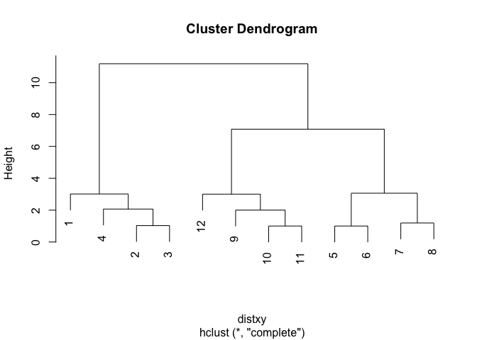

Euclidean Distance
------------------

Given two points in a plane, (x1,y1) and (x2,y2), the Euclidean distance is the square root of the sums of the squares of the distances between the two x-coordinates (x1-x2) and the two y-coordinates (y1-y2).

Manhattan or City Block Distance
--------------------------------

Manhattan distance is the sum of the absolute values of the distances between each coordinate.

Hierarchical clustering
-----------------------

We'll use this dataFrame to demonstrate an agglomerative (bottom-up) technique of hierarchical clustering and create a dendrogram.

``` r
dataFrame <- read.csv("dataFrame.csv")
distxy <- dist(dataFrame)
distxy
```

    ##            1         2         3         4         5         6         7
    ## 2   1.056608                                                            
    ## 3   2.080998  1.028637                                                  
    ## 4   3.011578  2.067959  1.231427                                        
    ## 5   4.344016  3.293123  2.292018  2.064957                              
    ## 6   5.267769  4.212049  3.189629  2.677927  1.003316                    
    ## 7   6.184230  5.134203  4.105715  3.400620  2.011110  1.023203          
    ## 8   7.277777  6.233719  5.207817  4.484952  3.062800  2.118276  1.193027
    ## 9   8.280324  7.235678  6.230320  5.527594  4.171410  3.200504  2.377677
    ## 10  9.233683  8.193465  7.187523  6.423011  5.151100  4.166341  3.277814
    ## 11 10.227889  9.188541  8.180871  7.391808  6.135336  5.144509  4.229308
    ## 12 11.190611 10.151389  9.138778  8.316457  7.082369  6.084045  5.136758
    ##            8         9        10        11
    ## 2                                         
    ## 3                                         
    ## 4                                         
    ## 5                                         
    ## 6                                         
    ## 7                                         
    ## 8                                         
    ## 9   2.028260                              
    ## 10  2.714383  1.009878                    
    ## 11  3.535092  2.003375  1.003453          
    ## 12  4.331632  3.001961  2.009127  1.021409

So 0.0815 (units are unspecified) between points 5 and 6 is the shortest distance. We can put these points in a single cluster and look for another close pair of points.

So 10 and 11 are another pair of points that would be in a second cluster.

### hclust()

R provides a simple function which you can call which creates a dendrogram for you.

``` r
hc <- hclust(distxy)
plot(hc)
```

<!-- -->

### as.dendrogram()

Labels are missing and leaves are all printed at the same level.

``` r
plot(as.dendrogram(hc))
```

<!-- -->

### Measuring the distances between clusters

1.  Complete linkage:
    If you're trying to measure a distance between two clusters, take the greatest distance between the pairs of points in those two clusters. Obviously such pairs contain one point from each cluster.
     (1) Find the points
     (2) Use dist() to find the distances between the points

2.  Average linkage:
     (1) First you compute an "average" point in each cluster (think of it as the cluster's center of gravity). You do this by computing the mean (average) x and y coordinates of the points in the cluster.
     (2) Then you compute the distances between each cluster average to compute the intercluster distance.

Heat Maps
---------

A very nice concise tutorial on creating heatmaps in R exists at
<http://sebastianraschka.com/Articles/heatmaps_in_r.html#clustering>

heatmap()
