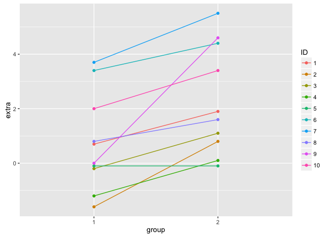

Catalog
-------

1.  Integration
2.  Combination
3.  Bernoulli Distribution
4.  Normal Gaussian Distribution
5.  Poisson Distribution
6.  Confidence Interval
7.  Agresti/Coull interval: Solve the Problem of Small n
8.  Z-statistic and t-distribution
9.  t Distribution
10. Segment Plot
11. Range of Data
12. Power
13. power.t.test
14. Resampling

Integration
-----------

``` r
mypdf <- function(x){x/2}
integrate(mypdf, lower = 0, upper = 1.6)
```

    ## 0.64 with absolute error < 7.1e-15

Combination
-----------

``` r
choose(10, 5)
```

    ## [1] 252

Bernoulli Distribution
----------------------

``` r
# filp a coin 5 times, P(head)=0.8, find prob. of tossing at least 3 heads
pbinom(q=2, size = 5, prob = 0.8, lower.tail = FALSE)
```

    ## [1] 0.94208

Normal (Gaussian) Distribution
------------------------------

``` r
# find the 97.5th percentile of a normal distribution with mean 3 and sd 2
qnorm(p=0.975, mean=3, sd=2)
```

    ## [1] 6.919928

``` r
# 2 ways to find P(X>1200)
pnorm(q=1200, mean=1020, sd=50, lower.tail = FALSE)
```

    ## [1] 0.0001591086

``` r
pnorm((1200-1020)/50, lower.tail = FALSE)
```

    ## [1] 0.0001591086

Poisson Distribution
--------------------

Now let's talk about our last common distribution, the Poisson. This is, as Wikipedia tells us, "a discrete probability distribution that expresses the probability of a given number of events occurring in a fixed interval of time and/or space if these events occur with a known average rate and independently of the time since the last event."

In other words, the Poisson distribution models counts or number of event in some interval of time. From Wikipedia, "Any variable that is Poisson distributed only takes on integer values."

The PMF of the Poisson distribution has one parameter, lambda. As with the other distributions the PMF calculates the probability that the Poisson distributed random variable X takes the value x. Specifically, P(X=x)=(lambda^x)\*e^(-lambda)/x!. Here x ranges from 0 to infinity.

The mean and variance of the Poisson distribution are both lambda.

Poisson random variables are used to model rates such as the rate of hard drive failures. We write X~Poisson(lambda\*t) where lambda is the expected count per unit of time and t is the total monitoring time.

For example, suppose the number of people that show up at a bus stop is Poisson with a mean of 2.5 per hour, and we want to know the probability that at most 3 people show up in a 4 hour period. We use the R function ppois which returns a probability that the random variable is less than 3. We only need to specify the quantile (3) and the mean (2.5 \* 4). We can use the default parameters, lower.tail=TRUE and log.p=FALSE. Try it now.

``` r
ppois(q = 3, lambda = 2.5*4)
```

    ## [1] 0.01033605

Finally, the Poisson distribution approximates the binomial distribution in certain cases. Recall that the binomial distribution is the discrete distribution of the number of successes, k, out of n independent binary trials, each with probability p. If n is large and p is small then the Poisson distribution with lambda equal to n\*p is a good approximation to the binomial distribution.

To see this, use the R function pbinom to estimate the probability that you'll see at most 5 successes out of 1000 trials each of which has probability .01. As before, you can use the default parameter values (lower.tail=TRUE and log.p=FALSE) and just specify the quantile, size, and probability.

``` r
pbinom(q=5, size=1000, prob=0.01)
```

    ## [1] 0.06613951

``` r
ppois(q=5, lambda=1000*0.01)
```

    ## [1] 0.06708596

Confidence Interval
-------------------

``` r
0.6 + c(-1, 1)*qnorm(0.975)*sqrt(0.6*0.4/100)
```

    ## [1] 0.5039818 0.6960182

``` r
binom.test(60, 100)$conf.int
```

    ## [1] 0.4972092 0.6967052
    ## attr(,"conf.level")
    ## [1] 0.95

``` r
poisson.test(5, 94.32)$conf
```

    ## [1] 0.01721254 0.12371005
    ## attr(,"conf.level")
    ## [1] 0.95

Agresti/Coull interval: Solve the Problem of Small n
----------------------------------------------------

A quick fix to the problem of having a small n is to use the Agresti/Coull interval. This simply means we add 2 successes and 2 failures to the counts when calculating the proportion p'. Specifically, if X is the number of successes out of the 20 coin flips, then instead of setting p'=X/20, let p'=(X+2)/24. We use 24 as the number of trials since we've added 2 successes and 2 failures to the counts. Note that we still use 20 in the calculation of the upper and lower bounds.

Z-statistic and t-distribution
------------------------------

Z=(X'-mu)/(sigma/sqrt(n))
t=(X'-mu)/(s/sqrt(n))
The only difference between the two is that the population std deviation, sigma, in Z is replaced by the sample standard deviation in the t. So the distribution of the t statistic is independent of the population mean and variance. Instead it depends on the sample size n.

As a result, for t distributions, the formula for computing a confidence interval is similar to what we did in the last lesson. However, instead of a quantile for a normal distribution we use a quantile for a t distribution. So the formula is Est +/- t-quantile \*std error(Est). The other distinction, which we mentioned before, is that we'll use the sample standard deviation when we estimate the standard error of Est.

The t distribution, invented by William Gosset in 1908, has thicker tails than the normal. Also, instead of having two parameters, mean and variance, as the normal does, the t distribution has only one - the number of degrees of freedom (df).

t Distribution
--------------

The t interval is always wider than the normal. This is because estimating the standard deviation introduces more uncertainty so a wider interval results.

``` r
qt(p=0.975, df=2)
```

    ## [1] 4.302653

``` r
# We want to find the probability of getting a t statistic as large as 2.5
pt(q=2.5, df=15)
```

    ## [1] 0.9877471

Segment Plot
------------

``` r
library(ggplot2)

ggplot(sleep, aes(group, extra, color = ID, group = ID)) +
        geom_point() +
        geom_path()
```

<!-- -->

Range of data
-------------

``` r
data(sleep)
g1 <- sleep[sleep$group==1, "extra"]
g1
```

    ##  [1]  0.7 -1.6 -0.2 -1.2 -0.1  3.4  3.7  0.8  0.0  2.0

``` r
range(g1)
```

    ## [1] -1.6  3.7

Power
-----

The probability of rejecting the null hypothesis when it is false, which is good and proper.

Power comes into play when you're designing an experiment, and in particular, if you're trying to determine if a null result (failing to reject a null hypothesis) is meaningful. For instance, you might have to determine if your sample size was big enough to yield a meaningful, rather than random, result.

Power gives you the opportunity to detect if your ALTERNATIVE hypothesis is true.

Type II error: Accepting a false null hypothesis

Beta is the probability of a Type II error, accepting a false null hypothesis; the complement of this is obviously (1 - beta) which represents the probability of rejecting a false null hypothesis. This is good and this is POWER!

An interactive plot for POWER:

``` r
library(manipulate)
mu0 <- 30
myplot <- function(sigma, mua, n, alpha){
        g <- ggplot(data.frame(mu = c(27, 36)), aes(x = mu))
        g <- g + stat_function(fun=dnorm, geom = "line",
                               args = list(mean = mu0, sd = sigma / sqrt(n)),
                               size = 2, col = "red")
        g <- g + stat_function(fun = dnorm, geom = "line",
                               args = list(mean = mua, sd = sigma / sqrt(n)),
                               size = 2, col = "blue")
        xitc <- mu0 + qnorm(1 - alpha) * sigma / sqrt(n)
        g <- g + geom_vline(xintercept = xitc, size = 3)
        g
}
# manipulate(
#         myplot(sigma, mua, n, alpha),
#         sigma = slider(1, 10, step = 1, initial = 4),
#         mua = slider(30, 35, step = 1, initial = 32),
#         n = slider(1, 50, step = 1, initial = 16),
#         alpha = slider(0.01, 0.1, step = 0.01, initial = 0.05)
# )
```

Power.t.test
------------

In the statement 1 - beta = Prob( X' &gt; mu\_0 + z\_(1-alpha) \* sigma/sqrt(n)) given mu\_a &gt; mu\_0, mu\_0 and alpha are specified, and X' depends on the data. The other four quantities, (beta, sigma, n, and mu\_a), are all unknown.

It should be obvious that specifying any three of these unknowns will allow us to solve for the missing fourth. Usually, you only try to solve for power (1-beta) or the sample size n.

An interesting point is that power doesn't need mu\_a, sigma and n individually. Instead only sqrt(n)\*(mu\_a - mu\_0) /sigma is needed. The quantity (mu\_a - mu\_0) / sigma is called the EFFECT SIZE. This is the difference in the means in standard deviation units. It is unit free so it can be interpreted in different settings.

Power is still a probability, namely P( (X' - mu\_0)/(S /sqrt(n)) &gt; t\_(1-alpha, n-1) given H\_a that mu &gt; mu\_a ). Notice we use the t quantile instead of the z. Also, since the proposed distribution is not centered at mu\_0, we have to use the non-central t distribution.

R comes to the rescue again with the function power.t.test. We can omit one of the arguments and the function solves for it. Let's first use it to solve for power.

We'll run it three times with the same values for n (16) and alpha (.05) but different delta and standard deviation values. We'll show that if delta (difference in means) divided by the standard deviation is the same, the power returned will also be the same. In other words, the effect size is constant for all three of our tests.

We'll specify a positive delta; this tells power.t.test that H\_a proposes that mu &gt; mu\_0 and so we'll need a one-sided test. First run power.t.test(n = 16, delta = 2 / 4, sd=1, type = "one.sample", alt = "one.sided")$power .

``` r
power.t.test(n=16, delta=2/4, sd=1, type="one.sample", alt="one.sided")$power
```

    ## [1] 0.6040329

``` r
power.t.test(n=16, delta=2, sd=4, type="one.sample", alt="one.sided")$power
```

    ## [1] 0.6040329

``` r
power.t.test(n=16, delta=100, sd=200, type="one.sample", alt="one.sided")$power
```

    ## [1] 0.6040329

So keeping the effect size (the ratio delta/sd) constant preserved the power. Let's try a similar experiment except now we'll specify a power we want and solve for the sample size n.

``` r
power.t.test(power=.8, delta = 2/4, sd=1, type = "one.sample", alt="one.sided")$n
```

    ## [1] 26.13751

``` r
power.t.test(power=.8, delta = 2, sd=4, type = "one.sample", alt="one.sided")$n
```

    ## [1] 26.13751

``` r
power.t.test(power=.8, delta = 100, sd=200, type = "one.sample", alt="one.sided")$n
```

    ## [1] 26.13751

Now use power.t.test to find delta for a power=.8 and n=26 and sd=1

``` r
power.t.test(power = .8, n=26, sd=1, type = "one.sample", alt="one.sided")$delta
```

    ## [1] 0.5013986

Resampling
----------

### Bootstrap

The bootstrap is a handy tool for making statistical inferences. It is used in constructing confidence intervals and calculating standard errors for statistics that might be difficult for some reason (e.g., lack of data or no closed form). Wikipedia tells us that bootstrapping is a technique which "allows estimation of the sampling distribution of almost any statistic using very simple methods."

Draw from a sample with replacements.

R package bootstrap has a great function for calculating confidence intervals.

### Permutation testing

Now, to permutation testing, another handy tool used in group comparisons. As bootstrapping did, permutation testing samples a single dataset a zillion times and calculates a statistic based on these samplings.

Permutation testing, however, is based on the idea of exchangability of group labels. It measures whether or not outcomes are independent of group identity. Our zillion samples simply permute group labels associated with outcomes. We'll see an example of this.
